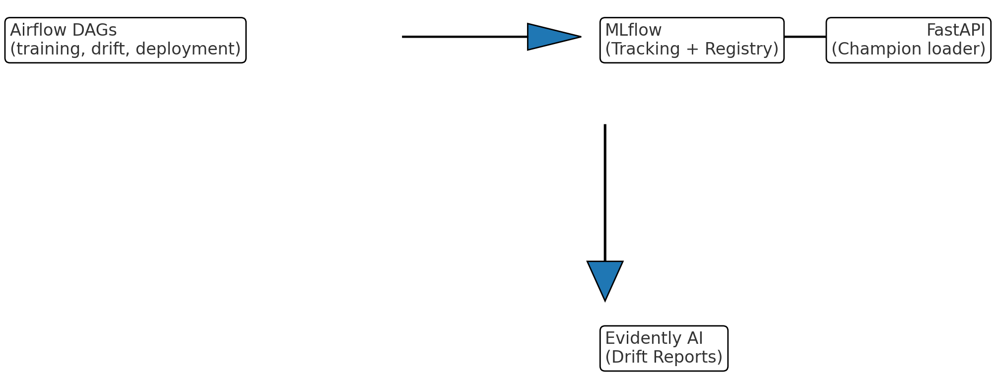

# Architecture Overview

## Components
- **Airflow** orchestrates three DAGs: training, drift, deployment.
- **MLflow** tracks runs, stores artifacts, and hosts the Model Registry.
- **FastAPI** serves the champion model, exposes `/predict`, `/model`, `/reload`.
- **Postgres** backs MLflow's registry/store.
- **Evidently AI** generates drift reports (HTML) logged to MLflow.

**Flow**: Training DAG → MLflow (metrics/artifacts) → Deployment DAG (checks thresholds, registers/ promotes) → FastAPI loads champion. Drift DAG runs periodically, logs reports to MLflow, and can trigger alerts.
